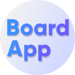

# Board App Extension

## Google Chrome extension

Google and Google Chrome are trademarks of Google Inc. Board App Extension is an extension for Google Chrome browser. Before install make sure you have the **latest version** of the browser.

## Description

This extension overrides the new tab content and launches **Board App** instead of a default empty page.
Please see the [Board App repository](https://github.com/Coredatapl/boardapp) to find out more about the app and how to customize it.

If you prefer to use **Board App** as a website or you don't use Chrome browser, please use [Board App web version](https://board.coredata.pl/) instead :)

**Board App** is being developed by [Coredata](https://coredata.pl). Please check our page if you have any questions!

Thanks for using **Board App** and have a nice day! :D
